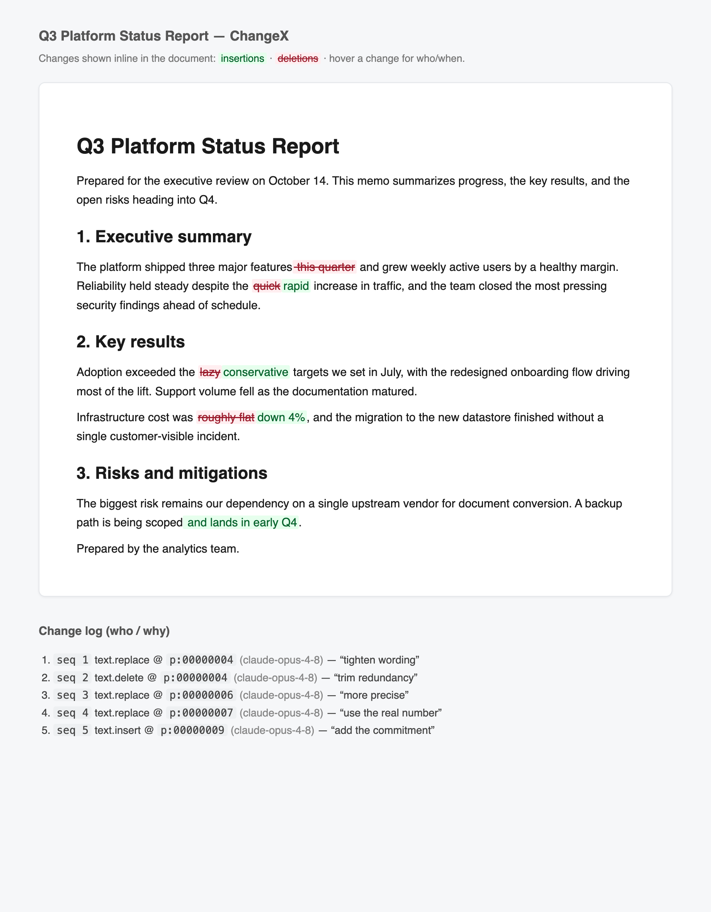
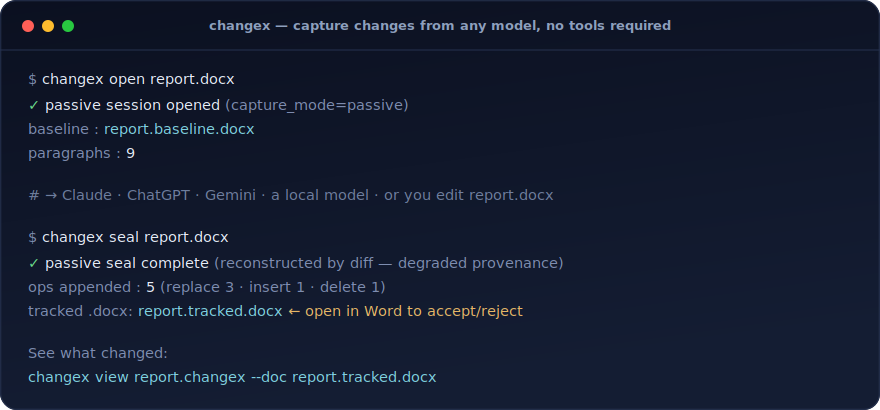
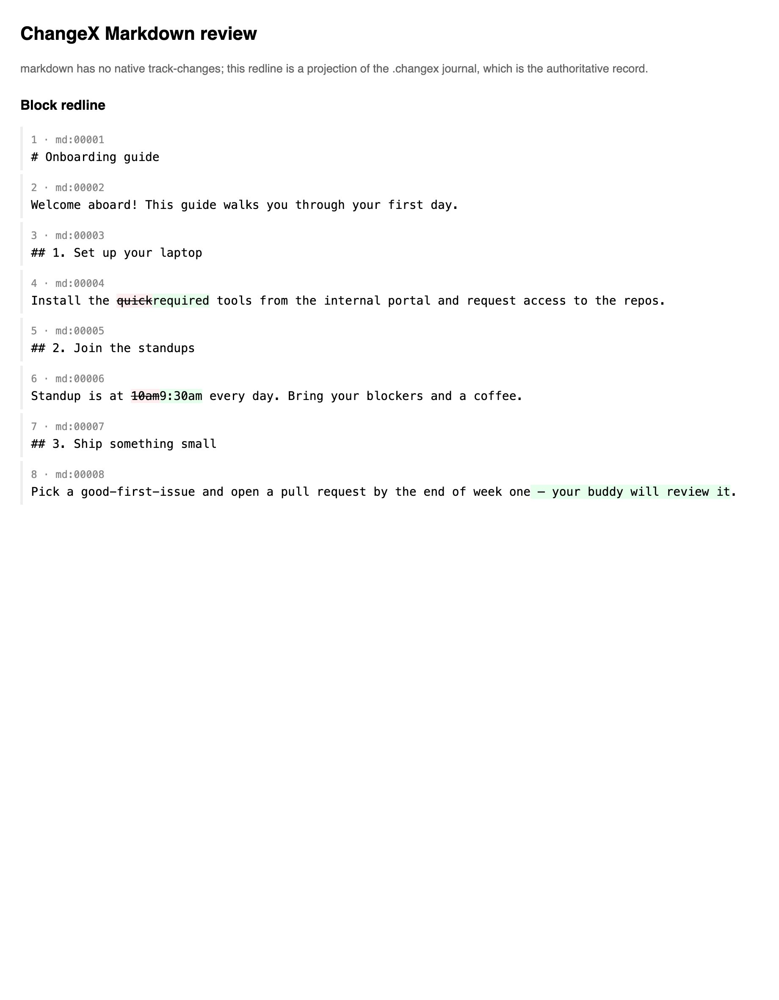
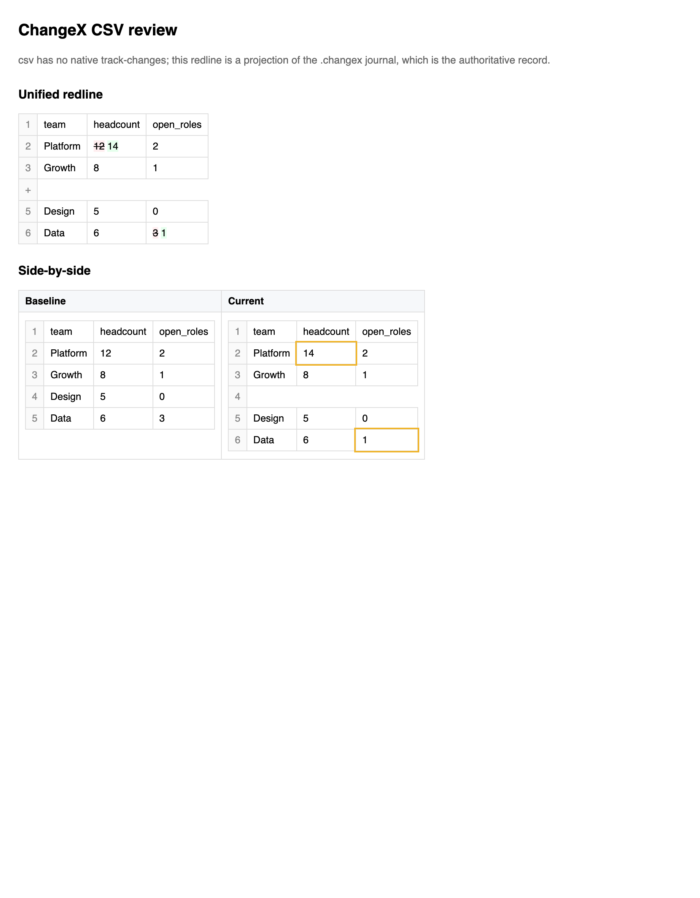

<p align="center">
  
</p>

<h1 align="center">📝 ChangeX</h1>

<p align="center"><b>See <i>exactly</i> what an AI changed in your documents — line by line, with receipts.</b></p>

<p align="center">
  <a href="https://pypi.org/project/changex/"></a>
  <a href="https://pypi.org/project/changex/"></a>
  <a href="https://github.com/ArioMoniri/changex/actions/workflows/ci.yml"></a>
  <a href="LICENSE"></a>
</p>

<p align="center">
ChangeX captures <b>every edit an AI makes</b> to your documents —
<code>.docx</code> · <code>.xlsx</code> · <code>.csv</code> · <code>.pptx</code> · <code>.md</code> · <code>.doc</code> —
<i>as it happens</i>, with <b>who / what / when / why</b>.<br>
A diff tells you <i>how two files differ</i>; ChangeX tells you <b>what the AI actually did, in order, and why</b> — and lets you accept or reject each change. 🎯
</p>

<p align="center">
  <a href="https://pypi.org/project/changex/"></a>
  &nbsp;
  <a href="docs/CLAUDE-SETUP.md"></a>
  &nbsp;
  <a href="docs/"></a>
</p>

<p align="center">
  
  <br><sub><em>ChangeX's default view: every AI edit inline in the document's own outline, plus a who/why change-log.</em></sub>
</p>

---

## 🚀 Quickstart

```bash
# 1) install the tool
uv tool install changex                      # or: pipx install changex · pip install changex

# 2) connect it to Claude CODE (terminal / IDE) — once; works in every folder, no duplicates
#    chatting in the Claude DESKTOP app instead? that's a SEPARATE config → docs/CLAUDE-SETUP.md
claude mcp add -s user changex -- changex-mcp

# 3) ask your assistant, e.g.:
#    "Use changex to open report.docx, tighten the intro as tracked changes,
#     save it, then show me a review of what changed."
```

That's it — every edit lands as a **real Word tracked change** you can accept/reject, with full provenance. No MCP, a local/offline model, or a human editing by hand? → **[Without tools](#-how-it-works)** below.

<details>
<summary><b>🔄 Updating — what to update, and how</b></summary>

<br>

**There's only one thing to update: the `changex` package.** The MCP server (`changex-mcp`) and every CLI command ship *inside* it — you never update those separately.

**1. Update the package — use the same installer you installed with:**

| If you installed with… | …update with |
|---|---|
| `uv tool install changex` | `uv tool upgrade changex` |
| `pipx install changex` | `pipx upgrade changex` |
| `pip install changex` | `pip install -U changex` |
| `uvx changex` *(zero-install)* | nothing — `uvx` always runs the latest |

Confirm it worked: **`changex --version`**.

> **Still on the old version after upgrading?** PyPI's install index can lag a release by a few minutes, so `pip` may grab the previous version (and leave a sub-package like `changex-core` behind). Force a clean upgrade of all of them — `pip install -U --no-cache-dir changex changex-core changex-mcp changex-api` — or just `uv tool upgrade changex`, which handles it cleanly.

**2. The MCP server updates automatically.** Because `changex-mcp` is part of the package, step 1 upgrades it too. Your Claude registration is just a pointer to the `changex-mcp` binary, so **do *not* re-run `claude mcp add` to "update" it** — that doesn't update anything, it only creates duplicate entries. It picks up the new version next time it launches.

> Registered the MCP as `uvx changex-mcp` (zero-install) instead of the binary? That form is pinned to a cached version — get the newest with `uvx changex-mcp@latest`, or switch to the installed binary (below).

**Only touch `claude mcp` to (re)connect or fix duplicates.** Register **once** with `-s user` so it works in every folder and never duplicates. If you already added it in several folders without `-s user`, reset to a single clean entry:

```bash
claude mcp remove changex                    # repeat in each folder you added it to
claude mcp add -s user changex -- changex-mcp
claude mcp list                              # changex → ✓ Connected
```

</details>

---

## 🧭 How it works

<p align="center">
  
</p>

There are **two ways** to capture an AI's edits — pick based on what your model can do:

| Path | Use it when | Provenance |
|------|-------------|------------|
| **🤖 From your AI (MCP)** | a tool-capable desktop client (Claude Desktop/Code, Cursor, Cline) | **full** — who / vendor / turn / prompt, per edit |
| **🪄 Without tools (`open`/`seal`)** | any model, offline/local, a script, or a human | **what-changed** (who/why is degraded — said out loud) |

Either way you get a portable, hash-chained **`.changex`** journal plus a tracked document to review.

<details>
<summary><b>🤖 Path A — from your AI (full provenance)</b></summary>

<br>

With the MCP server connected (Quickstart step 2), just ask in plain language. The model edits **through** ChangeX (`open_tracked → get_outline → edit → save_tracked`), so every change is a real Word revision — nothing silently rewritten.

> *"Use changex to open `~/Documents/Q3-report.docx`. Tighten the executive summary, fix the heading levels, and replace the passive voice in section 2 — make every change a **tracked revision** authored by you, save it, then show me a review of what changed."*

⚠️ **Each Claude app is set up separately — this trips everyone up:**

- **Claude Code** (terminal / IDE) — `claude mcp add -s user changex -- changex-mcp` (Quickstart step 2). This is the *only* thing `claude mcp list ✓ Connected` reflects.
- **Claude Desktop app** — has its **own** config; `claude mcp add` does **not** touch it. Add changex there (absolute path) and **fully restart the app** → [docs/CLAUDE-SETUP.md §B](docs/CLAUDE-SETUP.md).
- **claude.ai / ChatGPT in a browser** — can't read local files *at all*; use a desktop app, or Path B on a downloaded copy.

So if `claude mcp list` says `✓ Connected` but a chat says *"I can't find changex / upload the file,"* you're talking to a **different Claude than the one you configured** — set it up for that app too, see **[🔌 Set up your app](#-set-up-your-app)** below. [Why local-only →](docs/LOCAL-ACCESS.md)

**📎 Easiest in Claude Desktop — just upload the doc.** Drag your `.docx` into the chat and say *"use changex to tighten the intro and fix the heading, then give me the tracked file."* The upload lands where the changex MCP can read it (no Full Disk Access needed — it sidesteps the macOS privacy wall entirely). changex saves the **tracked `.docx` + `.changex`** and Claude hands them back as downloads.

</details>

<details>
<summary><b>🪄 Path B — without tools, from any model or a human</b></summary>

<br>

No MCP, no tool-calling, no SDK. Three steps:

1. **`changex open report.docx`** — snapshot the original.
2. **Let anything edit `report.docx` in place** — Claude, ChatGPT, a local llama, a script, or you.
3. **`changex seal report.docx`** — ChangeX diffs against the snapshot and reconstructs the changes into `report.changex` + a Word-openable `report.tracked.docx`.

<p align="center">
  
</p>

This path sees only before-and-after bytes, so it records a **faithful *what-changed*** but **degraded *who/why*** (agent / turn / prompt are `null`) — and ChangeX says so. For full provenance, use Path A.

</details>

---

## 🔌 Set up your app

**Easiest — one command writes the config for you:**

```bash
changex connect                  # list every app it can set up
changex connect claude-desktop   # writes the Desktop app config  (then ⌘Q + reopen)
changex connect cursor           # writes ~/.cursor/mcp.json
changex connect chatgpt          # prints the ChatGPT connector runbook (token + commands)
```

`changex connect <app>` merges the right MCP entry into that app's config — **backing the file up first** and using the absolute `changex-mcp` path so GUI apps find it. Targets: `claude-code` · `claude-desktop` · `cursor` · `cline` · `gemini` · `chatgpt` · `claude-web`.

Or wire it by hand — ChangeX plugs in three ways (**local MCP** = the app spawns `changex-mcp`; **remote MCP** = the app dials a URL; **REST/function tools**). Pick your app:

| Your app | How it connects | Reads local files? |
|---|---|---|
| **Claude Code** (terminal / IDE) | local MCP — one command | ✅ |
| **Claude Desktop app** | local MCP — *its own* config + restart | ✅ |
| **ChatGPT** (desktop or web) | remote MCP connector, or a custom-GPT Action | ✅ *(server runs on your Mac)* |
| **claude.ai** (web) | remote MCP connector | ✅ *(server runs on your Mac)* |
| **Cursor / Cline** | local MCP — config block | ✅ |
| **Gemini** (CLI / API) | local MCP / function tools | ✅ |
| **Ollama / LM Studio** | local MCP if supported, else the no-tools path | ✅ |

> 💡 GUI apps run with a minimal `PATH`, so in their config files use the **absolute** path from `which changex-mcp` (commonly `/opt/homebrew/bin/changex-mcp`). CLI clients launched from your shell usually find a bare `changex-mcp`.

<details>
<summary><b>🟧 Claude Code (terminal / IDE)</b></summary>

<br>

> **One command:** `changex connect claude-code` — or by hand:

```bash
claude mcp add -s user changex -- changex-mcp   # once; works in every folder, no duplicates
claude mcp list                                 # changex → ✓ Connected
```

This is the **only** thing `claude mcp list` reflects — it does *not* configure the Claude Desktop app (below).

</details>

<details>
<summary><b>🟧 Claude Desktop app</b> (separate from Claude Code!)</summary>

<br>

> **One command:** `changex connect claude-desktop`, then ⌘Q + reopen. Or by hand:

1. Get the absolute path: `which changex-mcp` → e.g. `/opt/homebrew/bin/changex-mcp`.
2. Add to `~/Library/Application Support/Claude/claude_desktop_config.json`:
   ```json
   { "mcpServers": { "changex": { "command": "/opt/homebrew/bin/changex-mcp", "args": [] } } }
   ```
3. **Fully quit & reopen** the app (⌘Q — not just close the window). The 🔨 tools icon should list `open_tracked`, `edit`, `save_tracked`, …

[Step-by-step → docs/CLAUDE-SETUP.md](docs/CLAUDE-SETUP.md)

</details>

<details>
<summary><b>🟩 ChatGPT (desktop or web)</b></summary>

<br>

> **One command:** `changex connect chatgpt` prints the token + exact commands below.

ChatGPT dials a **URL** (it can't reach `localhost`), so run the HTTP server and expose it with a tunnel — the server runs on your Mac, so it still edits your **local** files:

```bash
export CHANGEX_MCP_TOKEN=$(openssl rand -hex 32)
changex-mcp --http                                # serves http://127.0.0.1:9000/mcp
cloudflared tunnel --url http://127.0.0.1:9000    # or: ngrok http 9000  → an https URL
```

- **MCP connector** (Settings → Connectors, developer mode): add an MCP server → URL `https://<tunnel>/mcp`, header `Authorization: Bearer <CHANGEX_MCP_TOKEN>`.
- **Custom GPT → Actions:** instead run `changex-api` and import `https://<tunnel>/openapi.json` in the GPT's *Actions → Import from URL*.

[Full recipe → docs/CALL-FROM-YOUR-APP.md](docs/CALL-FROM-YOUR-APP.md)

</details>

<details>
<summary><b>🟦 claude.ai (web)</b></summary>

<br>

Same as the ChatGPT connector — run `changex-mcp --http` + a tunnel + a token, then **Settings → Connectors → Add custom connector**: URL `https://<tunnel>/mcp`, auth header `Authorization: Bearer <CHANGEX_MCP_TOKEN>`. (A web tab can't read local files itself; the tunneled server does the file I/O on your Mac.)

</details>

<details>
<summary><b>🟪 Cursor / Cline</b></summary>

<br>

> **One command:** `changex connect cursor` (or `changex connect cline`). Or by hand:

Add to `.cursor/mcp.json` (project) or `~/.cursor/mcp.json` (global) — Cline uses the same block in its MCP settings:

```json
{ "mcpServers": { "changex": { "command": "changex-mcp", "args": [] } } }
```

</details>

<details>
<summary><b>🟨 Gemini (CLI / API)</b></summary>

<br>

> **One command (CLI):** `changex connect gemini`. Or by hand:

**CLI** — add to `~/.gemini/settings.json`:

```json
{ "mcpServers": { "changex": { "command": "changex-mcp", "args": [] } } }
```

**API** — load [`integrations/gemini-functions.json`](integrations/gemini-functions.json) (function declarations) and route each call to the matching `changex-api` endpoint.

</details>

<details>
<summary><b>⬛ Ollama / LM Studio (local models)</b></summary>

<br>

- **Speaks MCP?** (LM Studio, recent builds) — register the same stdio block:
  ```json
  { "mcpServers": { "changex": { "command": "changex-mcp", "args": [] } } }
  ```
- **Doesn't?** (plain Ollama) — use the **no-tools path**: `changex open report.docx` → let the model rewrite the file → `changex seal report.docx`. Same as [Path B](#-how-it-works) above.

</details>

> Flags, security (loopback vs `--public` + token), the OpenAI Agents SDK, and REST/function-tool schemas: **[docs/CALL-FROM-YOUR-APP.md](docs/CALL-FROM-YOUR-APP.md)**.

---

## 👀 Review the changes

`changex seal` prints these with your real paths — or run them yourself:

```bash
changex review report.changex --doc report.tracked.docx --out review.html   # 📄 inline in the doc's outline
changex view   report.changex --doc report.tracked.docx                     # 🌐 live local page (accept/reject)
#  …or just open report.tracked.docx in Word — real native track changes 🖊️
```

💡 Paths with spaces need quotes: `changex open "My Report.docx"`.

---

## 📦 What it tracks

| Format | How changes show up |
|--------|---------------------|
| 📄 `.docx` | **Native Word track changes** — accept/reject in Word (text, paragraph, style, run-format, paragraph move) |
| 📊 `.xlsx` / `.csv` | Non-destructive review copy — colored cells, comments, a `Changes` sheet (original untouched) |
| 📽️ `.pptx` | Revision overlay + a generated "Revisions" summary slide |
| 📝 `.md` | Inline HTML redline (Markdown has no native track-changes) |
| 🗂️ `.doc` (legacy) | Auto-converted to `.docx` (LibreOffice), then native Word revisions — best-effort |

Every format also writes the portable **`.changex`** journal. Honest per-format limits: [docs/FIDELITY.md](docs/FIDELITY.md). Live **MCP** and the **`open`/`seal`** path are docx-only; other formats are captured with scripted **`changex track`** (see **Example prompts** below).

<details>
<summary>🖼️ <b>See it on every format</b></summary>

<br>

| Markdown — inline redline | CSV — side-by-side redline |
|:--:|:--:|
|  |  |
| **Excel** — review + provenance | **PowerPoint** — review |
|  |  |

</details>

---

## 📖 More

<details>
<summary><b>✍️ Example prompts (copy-paste)</b></summary>

<br>

Talk to ChangeX in plain language through your AI — each prompt notes what it does:

> **Tighten + restyle** — *"Open `report.docx` with changex. Replace every "utilize" with "use", fix the two run-on sentences in the intro, and bold the section headings — all as tracked revisions. Save and show me the review."*

> **Proofread, one change each** — *"Using changex, proofread `notes.docx` for grammar only. Make each fix a separate tracked change with a one-line rationale, then give me the change-log grouped by paragraph."*

> **Move a section** *(exercises `node.move`)* — *"Open `contract.docx`, move the "Termination" clause to just after "Payment" as a tracked move, and don't touch anything else."*

**Scripted edits (any format, no model)** — hand `changex track` a small `ops.json` for that one file, e.g. a spreadsheet:

```json
[
  { "kind": "cell.set", "sheet": "Q4", "ref": "B3", "before": "95", "after": "120", "rationale": "cloud spend rose" },
  { "kind": "formula.set", "sheet": "Q4", "ref": "C3", "before": "=B3*1.1", "after": "=B3*1.15", "rationale": "higher growth" }
]
```

```bash
changex track budget.xlsx ops.json --out budget.tracked.xlsx --changex budget.changex
changex view  budget.changex --doc budget.tracked.xlsx
```

(For `.docx`, ops are `text.replace` / `node.insert` / `style.change` / `format.run` / `node.move` by `node_id` — see [docs/CHANGEX_FORMAT.md](docs/CHANGEX_FORMAT.md).)

</details>

<details>
<summary><b>🖥️ CLI commands</b></summary>

<br>

Run `changex` (or `changex help`) for the full list:

```text
 ╔═╗╦ ╦╔═╗╔╗╔╔═╗╔═╗═╗ ╦
 ║  ╠═╣╠═╣║║║║ ╦║╣ ╔╩╦╝
 ╚═╝╩ ╩╩ ╩╝╚╝╚═╝╚═╝╩ ╚═
 provenance-first change tracking for AI document edits

  Track & review
    track    apply ops to a doc (.docx/.xlsx/.csv/.pptx/.md/.doc) → tracked file + .changex
    review   render an HTML / markdown redline (--doc = inline in the doc's outline)
    view     serve an interactive localhost review page (accept / reject)
    verify   check a .changex hash chain + baseline

  Passive — any model, even offline
    open     snapshot the baseline before anything edits the file
    seal     diff the edited file → reconstruct the tracked changes

  Connect to an app
    connect  wire ChangeX into Claude / ChatGPT / Cursor / Gemini / … (writes the config)

  Extras
    shell    interactive Python shell with changex_core preloaded
    help     show this command list
```

`changex shell` opens a Python REPL with `changex_core` preloaded; `changex --version` prints the version.

</details>

<details>
<summary><b>💻 Desktop app (optional) + downloads</b></summary>

<br>

ChangeX ships an optional **[Tauri](https://tauri.app)** desktop viewer — a small, double-clickable window over the **same** review UI as `changex view`.

**You usually don't need it.** `changex view` (zero-install local page) and the single-file HTML report already give the full accept/reject review on every platform. The desktop app just adds a native icon to double-click for non-technical reviewers; it doesn't add features.

<p align="center">
  <a href="https://github.com/ArioMoniri/changex/releases/latest/download/ChangeX-Viewer-macos.dmg"></a>
  &nbsp;
  <a href="https://github.com/ArioMoniri/changex/releases/latest/download/ChangeX-Viewer-windows.msi"></a>
  &nbsp;
  <a href="https://github.com/ArioMoniri/changex/releases/latest/download/ChangeX-Viewer-linux.AppImage"></a>
</p>

Installers attach to **[tagged releases](https://github.com/ArioMoniri/changex/releases)**: macOS `.dmg` is **signed + notarized**; Windows `.msi` and Linux `.AppImage`/`.deb` are unsigned. Build/sign details: [docs/CI-AND-SECRETS.md](docs/CI-AND-SECRETS.md).

</details>

---

## 🛟 Troubleshooting

<details open>
<summary><b>"can't open my file" / <code>Operation not permitted</code> (macOS) — even via Claude</b></summary>

<br>

This is **macOS privacy (TCC)**, not a changex bug: macOS blocks the *controlling app* (Claude
Desktop, Terminal, iTerm, VS Code…) from `~/Downloads`, `~/Documents`, and `~/Desktop`. The
`changex-mcp` server inherits that app's permission, so it's blocked exactly when the app is.

Run **`changex doctor`** — it names the exact app to grant, shows which folders are blocked, and links you straight to the settings pane:

```bash
changex doctor                  # diagnose
changex doctor --open-settings  # also open Full Disk Access
```

**Fix (one-time):** quit the app (⌘Q) → **System Settings → Privacy & Security → Full Disk Access** → turn **ON** that app (e.g. **Claude**) → reopen it. In the **ChangeX Viewer** app, the **Grant access** button opens this pane for you.

**Or skip permissions entirely:** in **Claude Desktop, upload the document into the chat** and ask changex to edit it — the upload lands where changex can read it. Or move the file out of those protected folders.

</details>

<details>
<summary><b>MCP server shows <code>✗ Failed to connect</code> (with <code>uvx</code> / <code>npx</code>)</b></summary>

<br>

The first `uvx changex-mcp` / `npx -y …` downloads the package + all deps into a fresh environment, which can exceed the MCP health-check timeout — so `claude mcp list` says *Failed to connect* even though the server is fine. **Fix — register the installed binary at user scope:**

```bash
claude mcp remove changex                 # drop any old uvx / per-folder entry
claude mcp add -s user changex -- changex-mcp
claude mcp list                           # changex should now show ✓ Connected
```

Prefer the zero-install `uvx` form? Warm the cache first: `uv tool install changex-mcp`.

</details>

<details>
<summary><b><code>WARNING: Cache entry deserialization failed, entry ignored</code> on <code>pip install</code></b></summary>

<br>

This is a **pip HTTP-cache warning, not a changex failure** — pip skipped a stale cache entry; the install still succeeds. To clear it:

```bash
python3 -m pip cache purge
python3 -m pip install -U changex --break-system-packages --no-cache-dir
```

If `pip` still reports an older version afterwards, the new one may not be on PyPI yet (the index CDN can lag a few minutes) — wait, or install from source (`git clone … && uv sync`).

</details>

<details>
<summary><b><code>error: externally-managed-environment</code> (PEP 668)</b></summary>

<br>

Your system Python refuses a global `pip install`. Use an isolated installer: `uv tool install changex` (or `pipx install changex`). If you must use `pip`, add `--break-system-packages`.

</details>

<details>
<summary><b>Legacy <code>.doc</code> won't open · paths with spaces</b></summary>

<br>

- **`.doc`** is converted to `.docx` via **LibreOffice** — install it and ensure `soffice` is on `PATH` (best-effort, lossy for exotic legacy features).
- **Paths with spaces** must be quoted: `changex open "My Report.docx"`.
- **Browser chats** can't read local files — use a desktop client, or `open`/`seal` on a downloaded copy.

</details>

---

## ℹ️ About

**ChangeX is a provenance-first change tracker for AI document edits.** It records *what* changed, *in what order*, and *who/why* — as a portable, hash-chained **`.changex`** journal — and projects that onto whatever review surface the format supports: **native Word track-changes** for `.docx`, a non-native overlay for `.xlsx` / `.csv` / `.pptx` / `.md`. It's **local-first** (no network calls in the core) and **vendor-neutral** (MCP + CLI behave the same across Claude, ChatGPT, Gemini, and local models). Design principle: **honesty over hype** — a degraded/reconstructed result is never presented as full provenance.

> **Repository description** *(GitHub "About" field):* Provenance-first change tracking for AI document edits — native Word track-changes + a portable, hash-chained `.changex` journal. Works with any model (MCP + CLI). docx · xlsx · csv · pptx · md.

<details>
<summary><b>📦 Published packages</b></summary>

<br>

All on PyPI (MIT) — `pip install changex` pulls them all:

| Package | What it is |
|---|---|
| [](https://pypi.org/project/changex/) | umbrella — installs the CLI **and** the MCP server |
| [](https://pypi.org/project/changex-core/) | the engine — model, journal, adapters, renderers, CLI |
| [](https://pypi.org/project/changex-mcp/) | the MCP server (stdio + remote HTTP) |
| [](https://pypi.org/project/changex-api/) | FastAPI REST + OpenAPI wrapper |

</details>

---

🤝 **Contributing:** see [CONTRIBUTING.md](CONTRIBUTING.md) · follow the [Code of Conduct](CODE_OF_CONDUCT.md)
&nbsp;·&nbsp; 🗺️ **Docs:** [Install](docs/INSTALL.md) · [Architecture](docs/ARCHITECTURE.md) · [.changex format](docs/CHANGEX_FORMAT.md) · [Fidelity](docs/FIDELITY.md) · [CI & secrets](docs/CI-AND-SECRETS.md)
&nbsp;·&nbsp; 📜 **License:** [MIT](LICENSE) — © 2026 Ariorad Moniri
