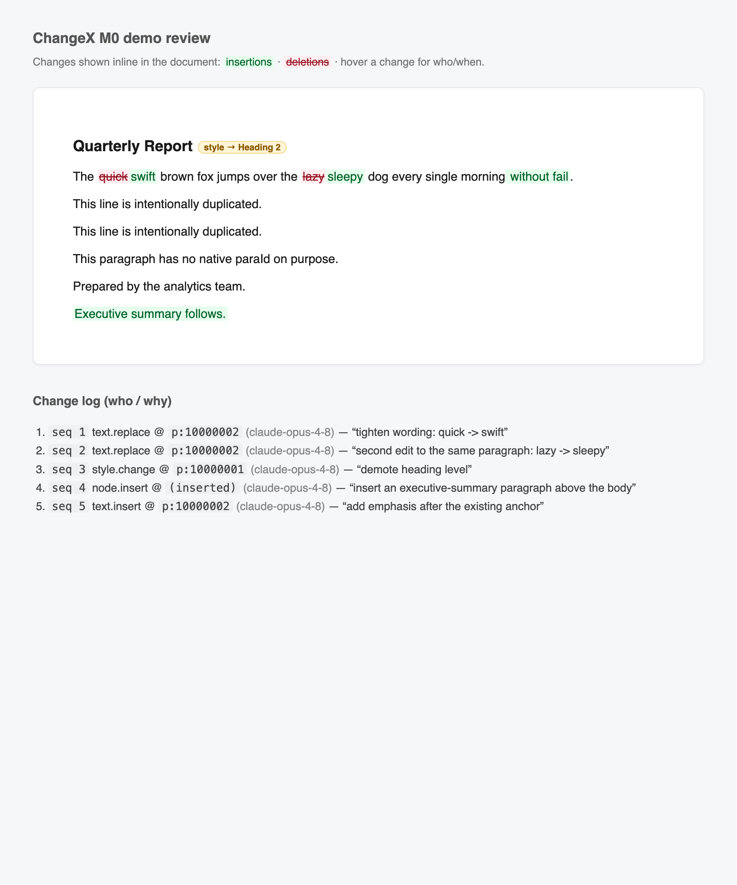

# 📝 ChangeX

### See *exactly* what an AI changed in your documents — line by line, with receipts.

[](https://pypi.org/project/changex/)
[](https://pypi.org/project/changex/)
[](https://github.com/ArioMoniri/changex/actions/workflows/ci.yml)
[](LICENSE)

ChangeX captures **every edit an AI makes** to your documents — `.docx` · `.xlsx` · `.csv` · `.pptx` · `.md` · `.doc` — *as it happens*, with **who / what / when / why**. It's not a diff after the fact — it's a live, attributable record you can review and accept or reject. 🎯

Works with **any model** 🤖 — Claude, ChatGPT, Gemini, or a local llama — and shows the changes as real Word track-changes 🖊️, a shareable HTML report 📄, or a live local web page 🌐.

<p align="center">
  
  <br><sub><em>Every AI edit shown inline in your document — hover any change for who &amp; when.</em></sub>
</p>

---

## ⚡ Install

[](https://pypi.org/project/changex/)
[](https://pypi.org/project/changex/)
[](docs/INTEGRATION.md)

```bash
uv tool install changex      # ✅ recommended — isolated, dodges PEP 668
# or:  pipx install changex   ·   pip install changex   ·   zero-install:  uvx changex
```

🔄 **Update later:** `uv tool upgrade changex` · `pipx upgrade changex` · `pip install -U changex`
&nbsp;(MCP via `uvx`? `uvx changex-mcp@latest` always grabs the newest.)

## 🤖 Use it from your AI

One line wires ChangeX into Claude Code (or any MCP client):

```bash
claude mcp add changex -- uvx changex-mcp
```

Then just ask 💬 — *"Open report.docx with changex, tighten the intro and fix the heading, then save tracked changes."* The model edits **through** ChangeX, so every change is captured with full provenance. ✅

> 🔐 **Reaching your local files:** this works in **desktop/local** clients — Claude **Desktop/Code**, Cursor, Cline — where `changex-mcp` runs *on your machine* and reads your local docs. A **browser** chat (claude.ai / ChatGPT web) can't see local files; use the desktop app, or the `open`/`seal` path below on a downloaded copy. **[Set it up → docs/CLAUDE-SETUP.md](docs/CLAUDE-SETUP.md)** · [why local-only](docs/LOCAL-ACCESS.md)

**No tools? No problem** — works with offline/local models, or even a human:

```bash
changex open report.docx     # 📸 snapshot the original
#  …anything edits report.docx in place (a model, a script, or you)…
changex seal report.docx     # 🔍 reconstruct the changes → report.changex + report.tracked.docx
```

👉 Per-app setup for **ChatGPT, Gemini, Cursor, Cline, Ollama, LM Studio**: [docs/CALL-FROM-YOUR-APP.md](docs/CALL-FROM-YOUR-APP.md)

## 👀 See the changes — your pick

`changex seal` prints these for you with your real paths — or run them on the
`.changex` + tracked `.docx`:

```bash
changex review report.changex --doc report.tracked.docx --out review.html   # 📄 inline in the doc's outline
changex view   report.changex --doc report.tracked.docx                     # 🌐 live local page (accept/reject)
#  …or just open report.tracked.docx in Word — real native track changes 🖊️
```

💡 Paths with spaces need quotes: `changex open "My Report.docx"`.

## 📦 What it tracks

| Format | How changes show up |
|--------|---------------------|
| 📄 `.docx` | **Native Word track changes** — accept/reject right in Word |
| 📊 `.xlsx` / `.csv` | Non-destructive review copy — colored cells, comments, a `Changes` sheet (your original stays untouched) |
| 📽️ `.pptx` | Revision overlay + a generated "Revisions" summary slide |
| 📝 `.md` | Inline HTML redline (Markdown has no native track-changes) |
| 🗂️ `.doc` (legacy) | Auto-converted to `.docx` (LibreOffice), then native Word revisions |

Every format also writes a portable **`.changex`** journal — a hash-chained log of each operation with its provenance. Honest per-format limits: [docs/FIDELITY.md](docs/FIDELITY.md). ⚖️

## 🧠 Why not just diff the files?

A diff tells you *how two files differ*. ChangeX tells you **what the AI actually did, in order, and why** — and lets you accept or reject each change. 🔎

## 🗺️ Dig deeper

📥 [Install](docs/INSTALL.md) · 🛠️ [Claude setup](docs/CLAUDE-SETUP.md) · 🔌 [Integrations](docs/INTEGRATION.md) · 🔐 [Local file access](docs/LOCAL-ACCESS.md) · 🏗️ [Architecture](docs/ARCHITECTURE.md) · 📐 [.changex format](docs/CHANGEX_FORMAT.md)

🎬 **Try all formats:** `python scripts/demo_all_formats.py` · 🐚 **Prefer code?** `changex shell` (Python with ChangeX preloaded)

## 📜 License

[MIT](LICENSE) — © 2026 Ariorad Moniri.
